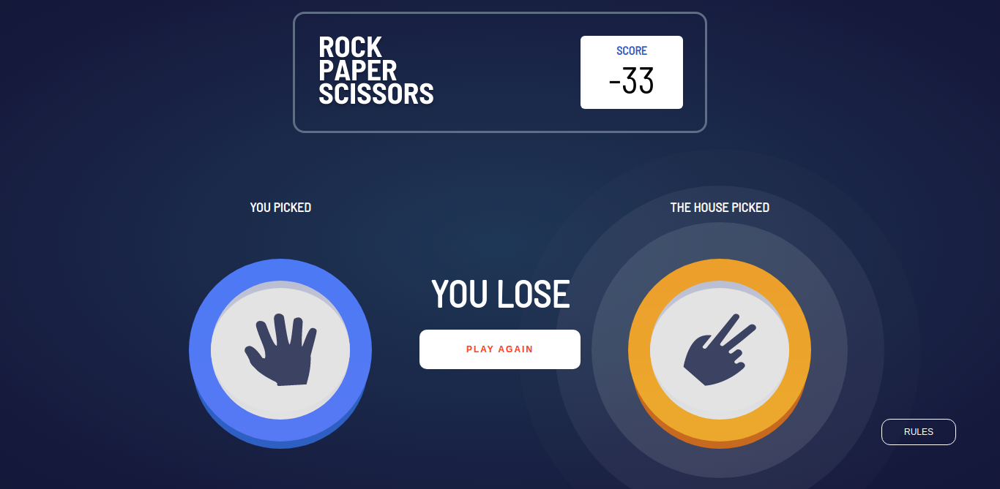
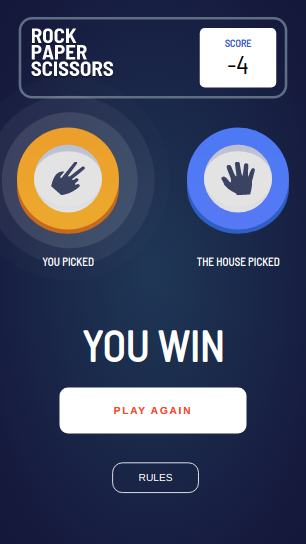

# Frontend Mentor - Rock, Paper, Scissors solution

This is a solution to the [Rock, Paper, Scissors challenge on Frontend Mentor](https://www.frontendmentor.io/challenges/rock-paper-scissors-game-pTgwgvgH). Frontend Mentor challenges help you improve your coding skills by building realistic projects. 

## Table of contents

- [Overview](#overview)
  - [The challenge](#the-challenge)
  - [Screenshot](#screenshot)
  - [Links](#links)
- [My process](#my-process)
  - [Built with](#built-with)
  - [What I learned](#what-i-learned)
  - [Continued development](#continued-development)
  - [Useful resources](#useful-resources)
- [Author](#author)
- [Acknowledgments](#acknowledgments)


## Overview

### The challenge

Users should be able to:

- View the optimal layout for the game depending on their device's screen size
- Play Rock, Paper, Scissors against the computer
- Maintain the state of the score after refreshing the browser _(optional)_
- **Bonus**: Play Rock, Paper, Scissors, Lizard, Spock against the computer _(optional)_

### Screenshot




### Links

- Solution URL: [Add solution URL here](https://your-solution-url.com)
- Live Site URL: [Add live site URL here](https://your-live-site-url.com)

## My process

### Built with

- Semantic HTML5 markup
- CSS custom properties
- Flexbox
- CSS Grid
- Mobile-first workflow
- [React](https://reactjs.org/) - JS library
- [Styled Components](https://styled-components.com/) - For styles
- [react-cookie](https://www.npmjs.com/package/react-cookie) - for storing cookies

### What I learned

Learnt a thing or two about updating states in react. 
Update is done right from the component's position in the parent component. If a Math.random() is attached to a prop of a component, the random number is always run each time the state of that component updates. therefore, there will be different numbers each time even though the file for the update is different from the file that the Math.random function was set in.

Example is as follows:

```jsx
  ParentComponent = () => {
    return (
      <ChildComponent ran = {Math.random()} />
    )
  }
```

```jsx
  ChildComponent = ({ran}) => {
    const [random, setRandom] = useState(false)
    function _setRandom() {
      setRandom(!random)
    } 

    console.log(ran)
    
    return (
      <button onClick={_setRandom}>
    )
  }
```

### Continued development

I still have to develop in areas of smooth responsiveness and caching images for offline use.

### Useful resources

- [Adding your own origin - git](https://stackoverflow.com/questions/42830557/git-remote-add-origin-vs-remote-set-url-origin) - This helped me know how to go about removing the Frontend Mentor repo and adding mine. I will use it going forward for any cloned repo.
- [Styled components documentation](https://styled-components.com/docs) - I'll keep on learning this concept. It is very cool for styling components and extending styles for other components. makes writing CSS more traditional, away from the JavaScript style JSX presents.

## Author

- Website - [Ajiboye Mayokun](https://rock-and-paper-and-scissors.netlify.app/)
- Frontend Mentor - [@yourusername](https://www.frontendmentor.io/profile/mayokun)
- Twitter - [@yourusername](https://www.twitter.com/AjibsonMayokunA)


Special Thanks to Frontend Mentor for the wonderful and tasking designs that are given as challenges. I hope to keep on working hard and bring the best out of myself with Frontend mentor leading the way.
